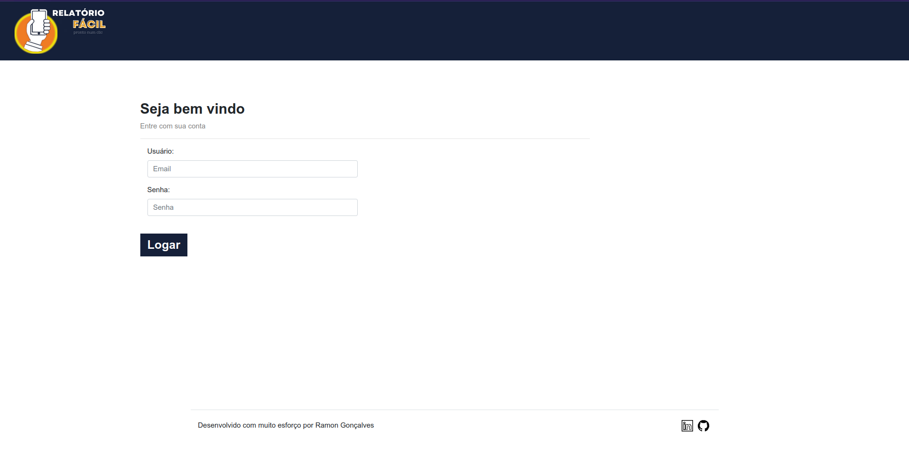
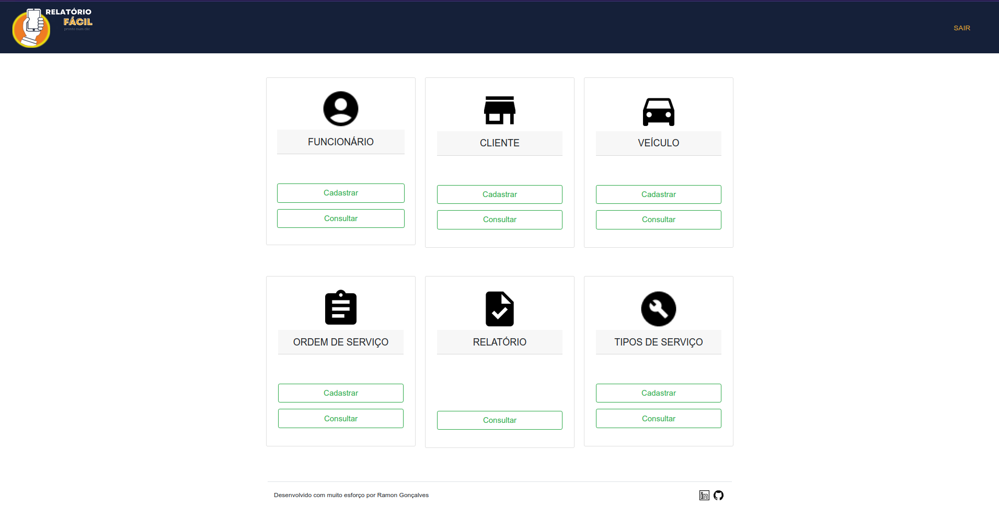
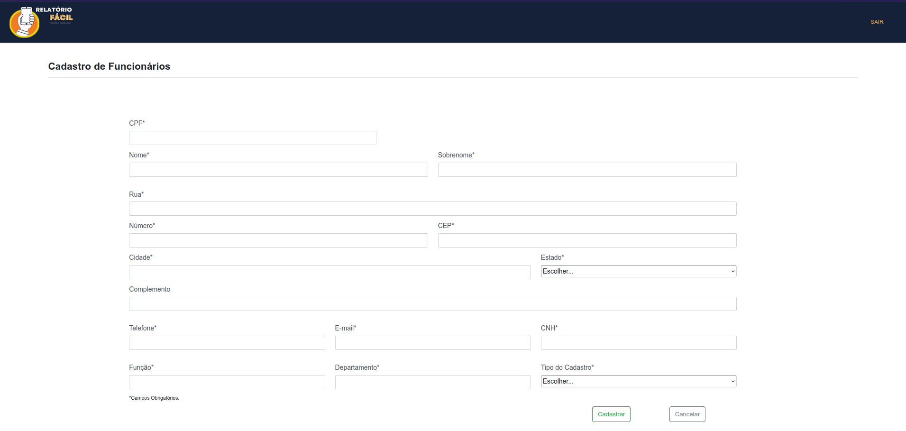
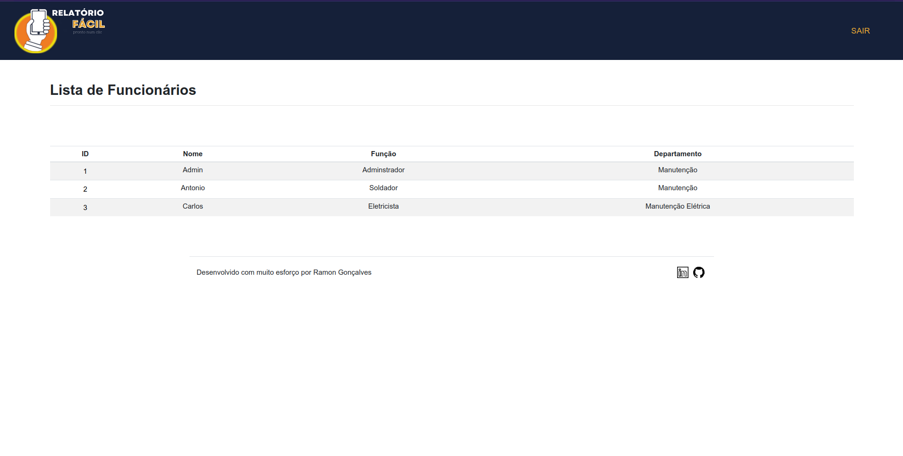
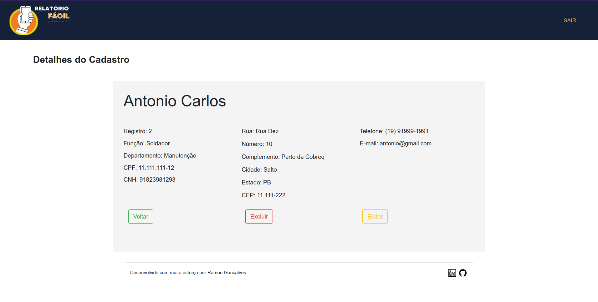

<p align="center">
  RELATÓRIO FÁCIL
</p>

<h2 align="center">Tópicos 📋</h2>

   <p>
   
   - [Sobre ](#sobre-)
   - [Layout ](#layout-)
   - [Como Usar ](#como-usar-)

   </p>

---

<h2 align="center">Sobre</h2>
   
<p>
    RELATÓRIO FÁCIL é uma aplicação web para gerenciamento de ordens de serviço e de relatórios de serviço.<br>
    Foi desenvolvida como requisito para a matéria TG (Trabalho de Graduação) da FATEC Indaiatuba.<br>
    RELATÓRIO FÁCIL foi desenvolvido utilziando o framework Django.<br>
    Tecnologias utilizdas:<br>
    - Django<br>
    - Python<br>
    - SQL<br>
    - HTML<br>
    - CSS<br>
    - JS<br>
    <br>
    Alguma das características são:    
    - Formulário simples para cadastro de funcionário, veículo, cliente e ordem de serviço;<br>
    - Os dados são salvos no banco de dados postgreSQL, também podenendo ser gerenciado pelo Django Admin;<br>
    - Listagem de funcionário, veículo, cliente, ordem de serviço e relatório de serviço;<br>
    - A listagem de relatório de serviço é uma integração com o aplicativo para dispositivos móveis que também faz parte do escopo do projeto;<br>
    - Edição e exclusão de cadastros.

</p>

---

<h2 align="center">Layout</h2>

<p align="center">
  Tela de Login
</p>

   <p align="center">
      
   </p>
   <br>

<p align="center">
  Tela Principal
</p>

   <p align="center">
      
   </p>
   <br>

<p align="center">
  Tela de Cadastro
</p>

   <p align="center">
      
   </p>
   <br>

<p align="center">
  Tela de Consulta
</p>

   <p align="center">
      
   </p>
   <br>

<p align="center">
  Tela de Detalhes do Cadastro
</p>

   <p align="center">
      
   </p>
   <br>

<p align="center">
  Tela Editar Cadastro
</p>

   <p align="center">
      
   </p>
   <br>

---

<h2 align="center">Como Usar</h2>

<h3>Requisitos</h3>
<p>
  - Python (https://www.python.org/)<br>
  - pip (https://pypi.org/project/pip/)<br>
  - Django (https://www.djangoproject.com/)<br>
  - Crispy_forms (https://django-crispy-forms.readthedocs.io/en/latest<br>
  - crispy_bootstrap5 (https://github.com/django-crispy-forms/crispy-bootstrap5)<br>
  - PsycoPG2 (https://pypi.org/project/psycopg2/)<br>
  - PostgreSQL (https://www.postgresql.org/)<br>
  - pgAdmin (https://www.pgadmin.org/)<br>
  - Necessário criar banco de dados conforme dados encontrados no arquivo settings.py
</p>

```
- Clone esse repositório:
$ git clone https://github.com/RamonTadeuGoncalves/EasyReport_Web

python manage.py makemigrations
python manage.py migrate
python manage.py runserver
```

<br>

---

> Esse projeto foi desenvolvido com muito esforço por mim **[Ramon Tadeu Gonçalves](https://www.linkedin.com/in/ramon-gon%C3%A7alves-a900bb190/)** <br>

---
